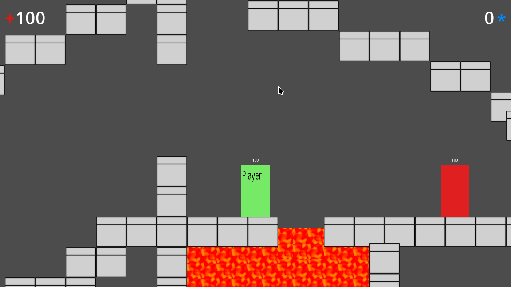

# TestGodot2D

	

A 2D game prototype built with the Godot Engine, demonstrating modular game architecture and reusable component design. This project serves as a technical demonstration of game development patterns and organized code structure.

## Overview

This project implements a foundational 2D game framework with player movement, enemy AI, combat systems, and UI elements. The architecture emphasizes separation of concerns through modular design, making components easily maintainable and reusable across different game contexts.

## Features

- **Modular Architecture**: Game systems are organized into self-contained modules including character management, damage handling, enemy behavior, and UI components
- **Finite State Machine**: Enemy AI utilizes a state machine pattern for patrol and attack behaviors
- **Combat System**: Damageable entities with hit detection and health management
- **Dynamic UI**: Heads-up display with health tracking, enemy counters, and game state notifications
- **Level Design**: Tile-based level system with interactive elements including hazards and exits

## Project Structure

The project is organized into focused modules under the `modules/` directory:

- **character/**: Core player character mechanics and attributes
- **damageable/**: Generic damage system for entities that can take damage
- **enemy/**: Enemy AI, behavior states, and weapon systems
- **finite_state_machine/**: Reusable state machine implementation for AI behavior
- **heads_up_display/**: UI elements including health bars, counters, and game screens
- **hit_body/**: Collision and hit detection systems
- **player/**: Player-specific mechanics and weapon handling

The `game_levels/` directory contains level assets and tile sets, demonstrating practical application of the modular systems.

## Technical Implementation

- Written in GDScript with clear separation between logic and assets
- Scene files maintain visual representations while scripts handle behavior
- Custom tools included for code analysis and directory structure visualization
- Follows Godot best practices for node composition and signal usage

## Development Notes

This project was developed as a portfolio piece demonstrating proficiency in:
- Game engine architecture and organization
- Object-oriented design patterns in game development
- Clean code practices and documentation
- Version control and project management

## Requirements

- Godot Engine >4.4.1
- No additional dependencies or external assets required

## License

This project is open source and available under the MIT License. See the LICENSE file for details.
